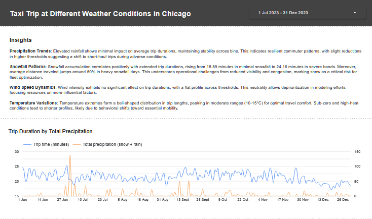
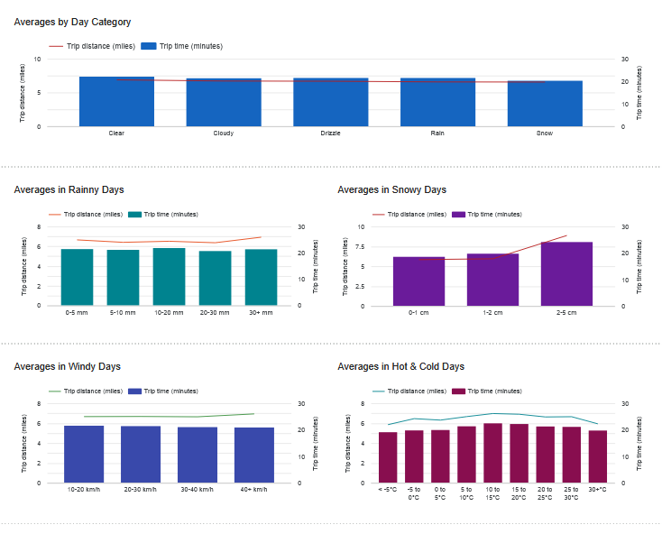

# Chicago Taxi Trips & Weather Analysis

Exploring whether weather conditions affect the duration of taxi trips in Chicago, using publicly available data from June to December 2023.

**[View the Looker Studio Dashboard](https://lookerstudio.google.com/s/gO7msv7yTKQ)**




## Architecture

```
Open-Meteo API  ──>  Cloud Function  ──>  BigQuery (bronze_weather_daily)
                     (daily @ 6am UTC)          │
                                                ▼
BigQuery Public  ──>  load script    ──>  BigQuery (bronze_taxi_trips_filtered)
(taxi_trips)                                    │
                                                ▼
                                          dbt (staging + marts)
                                                │
                                                ▼
                                          Looker Studio Dashboard
```

### Data layers

| Layer | Dataset | Tables | Description |
|-------|---------|--------|-------------|
| Bronze | `chicago_taxi_weather` | `bronze_weather_daily`, `bronze_taxi_trips_filtered` | Raw ingested data |
| Silver | `chicago_taxi_weather_staging` | `stg_taxi_trips`, `stg_weather` | Cleaned, typed, filtered |
| Gold | `chicago_taxi_weather_marts` | `taxi_weather_joined`, `agg_trip_duration_by_weather` | Joined and aggregated for analysis |

### Key design decisions

- **Weather source**: [Open-Meteo Archive API](https://open-meteo.com/) — free, no API key required, provides daily historical weather for any coordinates.
- **Ingestion strategy**: A Cloud Function runs daily at 6:00 UTC via Cloud Scheduler, ingesting the previous day's weather. Historical data (Jan–Dec 2023) is backfilled once via a script.
- **Idempotency**: Weather ingestion uses a MERGE (upsert) pattern — re-running the same date range won't create duplicates.
- **Trip duration**: Calculated as `trip_seconds / 60` (the field `trip_seconds` is provided by the original Chicago taxi dataset).
- **Column-level security**: An authorized view (`bronze_taxi_trips_secure`) exposes all columns except `payment_type`. Only the project owner has direct access to the base table.

## Prerequisites

- GCP project with billing enabled
- `gcloud` CLI authenticated (`gcloud auth application-default login`)
- Terraform >= 1.5
- Python >= 3.10

```bash
pip install -r requirements.txt
```

## Setup

### 1. Package the Cloud Function

```bash
# Linux / macOS
cd ingestion
zip function_source.zip main.py requirements.txt
cd ..

# Windows (PowerShell)
cd ingestion
Compress-Archive -Path main.py,requirements.txt -DestinationPath function_source.zip -Force
cd ..
```

### 2. Provision infrastructure with Terraform

```bash
cd terraform

# Create your terraform.tfvars (see terraform.tfvars.example)
cp terraform.tfvars.example terraform.tfvars
# Edit terraform.tfvars with your project_id and owner_email

terraform init
terraform plan
terraform apply
```

This creates:
- BigQuery dataset, tables, and authorized view
- Service account with BigQuery roles
- Cloud Function (Gen2) for daily weather ingestion
- Cloud Scheduler job (daily at 06:00 UTC)

### 3. Backfill weather data

```bash
# Linux / macOS
python scripts/backfill_weather.py \
    --project <YOUR_PROJECT_ID> \
    --start-date 2023-01-01 \
    --end-date 2023-12-31

# Windows (PowerShell)
python .\scripts\backfill_weather.py `
    --project <YOUR_PROJECT_ID> `
    --start-date 2023-01-01 `
    --end-date 2023-12-31
```

### 4. Load taxi trip data

```bash
# Linux / macOS
python scripts/load_taxi_trips.py \
    --project <YOUR_PROJECT_ID>

# Windows (PowerShell)
python .\scripts\load_taxi_trips.py `
    --project <YOUR_PROJECT_ID>
```

This queries the public `bigquery-public-data.chicago_taxi_trips.taxi_trips` dataset, filtered to June–December 2023 (~6.4M rows). The query stays within BigQuery's free tier.

### 5. Run dbt

```bash
cd dbt

# Linux / macOS
export GCP_PROJECT=<YOUR_PROJECT_ID>

# Windows (PowerShell)
$env:GCP_PROJECT="<YOUR_PROJECT_ID>"

dbt seed
dbt run
dbt test
```

### 6. Column-level security

The `bronze_taxi_trips_secure` view excludes the `payment_type` column.
- Only the owner email (configured in `terraform.tfvars`) has direct access to the base table containing `payment_type`.
- All other users query through the authorized view.

## Looker Studio Dashboard

The dashboard connects to the **`chicago_taxi_weather_marts`** dataset, which contains:
- `taxi_weather_joined` — every trip joined with that day's weather data
- `agg_trip_duration_by_weather` — daily aggregates of trip duration by weather conditions

### Charts included

1. **Time Series** — Daily avg duration overlaid with precipitation and snowfall
2. **Avg Duration vs Precipitation** — How trip duration changes on rainy days
3. **Avg Duration vs Snowfall** — Trip duration and distance on snowy days
4. **Avg Duration vs Wind Speed** — Whether wind affects trip times
5. **Duration vs Temperature** — Trip duration and average temperature
6. **Trip Duration by Weather Category** — Comparison across weather types (Clear, Rain, Snow, etc.)


## Project Structure

```
├── terraform/              # Infrastructure as Code
│   ├── main.tf             # All GCP resources
│   ├── variables.tf        # Input variables
│   ├── outputs.tf          # Output values
│   └── terraform.tfvars.example
├── ingestion/              # Cloud Function for daily weather ingestion
│   ├── main.py             # Fetch from Open-Meteo + upsert to BigQuery
│   └── requirements.txt
├── scripts/                # One-time setup scripts
│   ├── backfill_weather.py # Historical weather backfill
│   └── load_taxi_trips.py  # Copy filtered taxi data from public dataset
├── dbt/                    # Data transformations
│   ├── dbt_project.yml
│   ├── profiles.yml
│   ├── models/
│   │   ├── staging/        # stg_taxi_trips, stg_weather
│   │   └── marts/          # taxi_weather_joined, agg_trip_duration_by_weather
│   └── seeds/              # weather_code_mapping.csv (WMO codes)
├── images/                 # Dashboard screenshots
├── requirements.txt        # Python dependencies
└── README.md
```
